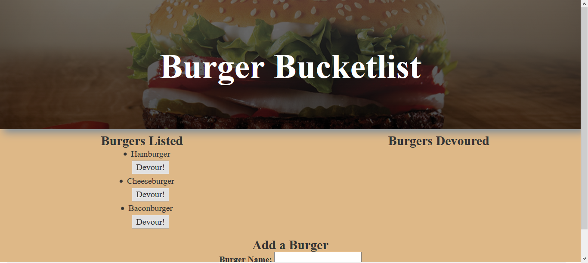
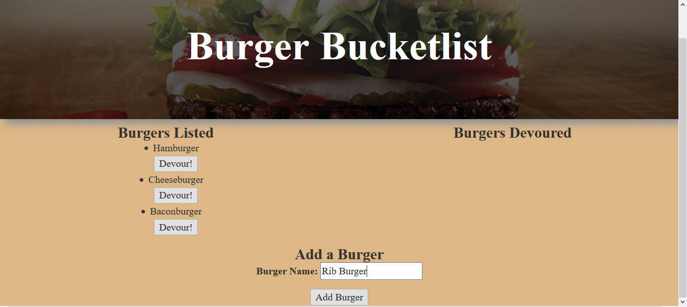
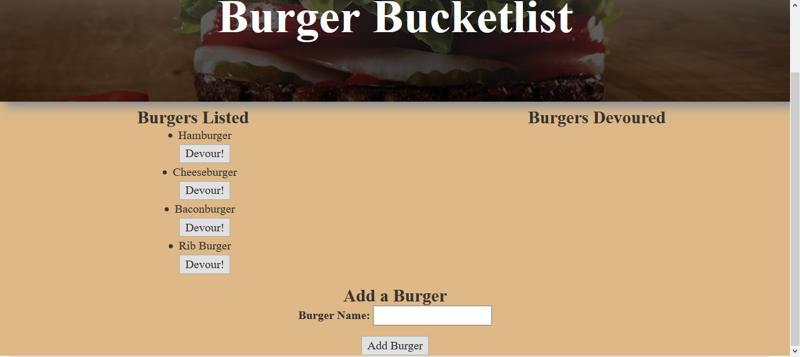
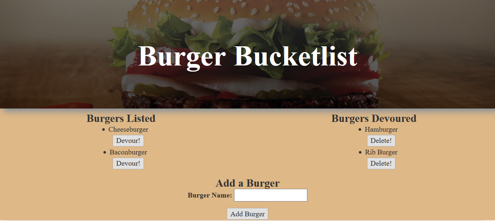

# Burger Bucketlist

A MySQL-backed application which allows users to list and add burger's they would like to eat, and the devour them.

## How to Use

User opens application via the Heroku [link](https://burger-bucketlist.herokuapp.com/) to find that there are already three burgers listed and ready to devour. If the user does not like what is on offer, he may add a burger he wants by typing it under "Add a Burger" and clicking the submit button. Once the added burger is placed into the "Listed Burger's" with the other ones, it may devoured by clicking "Devour It!", which causes the eaten burger to be moved into the "Devoured Burger's" list. The user may also devour the other burger's, as well as add and devour more burger's.

There is an option to delete the burgers, but it does not work.

### Prerequisites

npm [mysql](https://www.npmjs.com/package/mysql)

npm [bodyParser](https://www.npmjs.com/package/body-parser)

npm [express](https://www.npmjs.com/package/express)

npm [express-handlebars](https://www.npmjs.com/package/express-handlebars)

### Technologies Used

Languages - HTML5, CSS3, Javascript

Run-time system - Node.js

Package manager - NPM

Database - MySQL

Templating engine - Handlebars

Run-time system - Node.js

Other tools, technologies, and techniques - MVC, ORM

Text Editor - Visual Studio Code

## Preview

### Inital Page with Three Listed Burgers
- - - -

### New Burger Being Added
- - - -

### New Burger Added to List
- - - -

### New Burger Devoured
- - - -

## Contributing

Please feel free to branch off with tweaks and making a repo; open to suggestions!

## Future Development

* Making the "Delete" button work

## Authors

* **Wesley Hutchins** - [Github](https://github.com/WesPres1990)